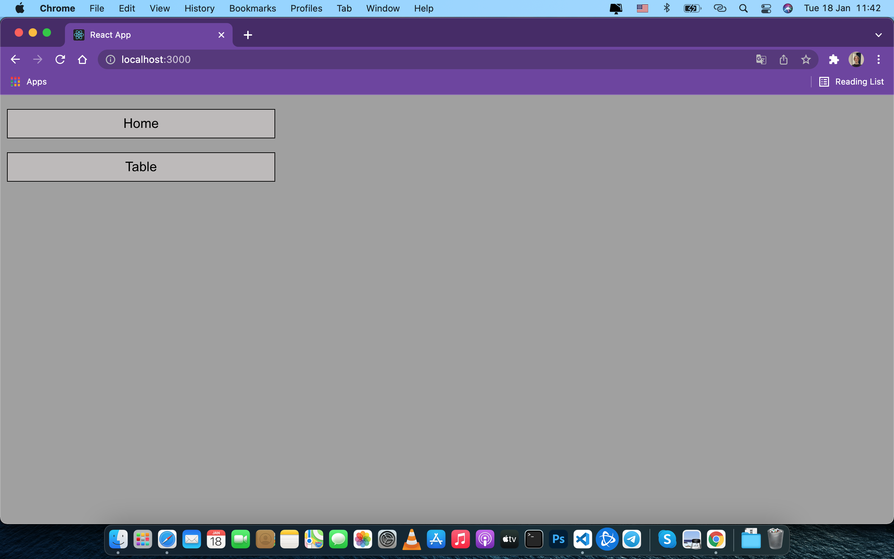
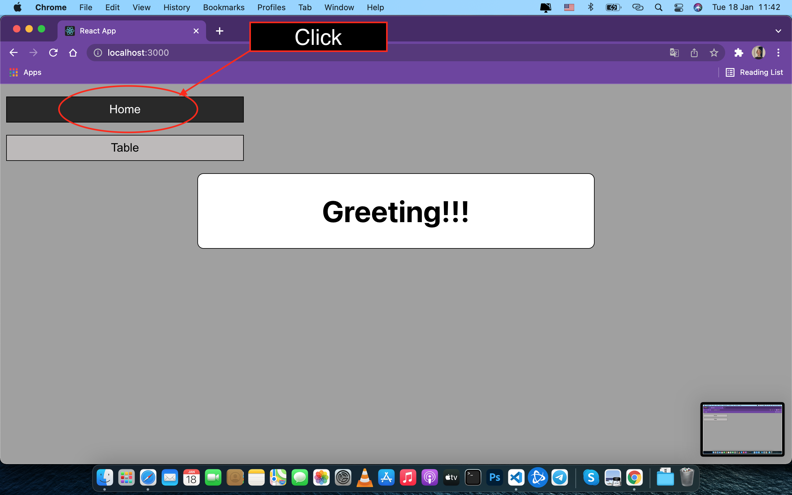
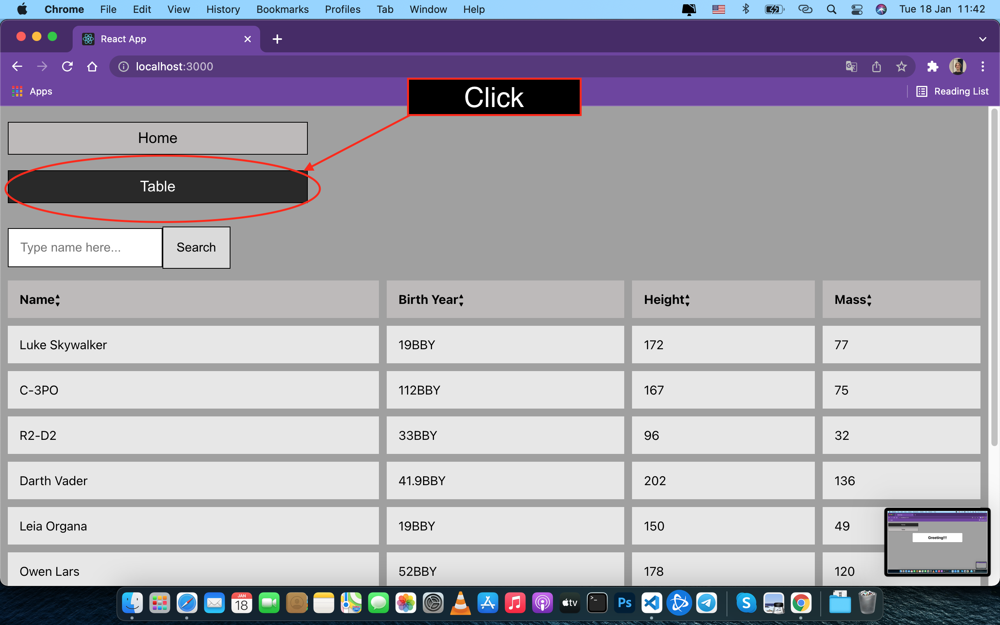
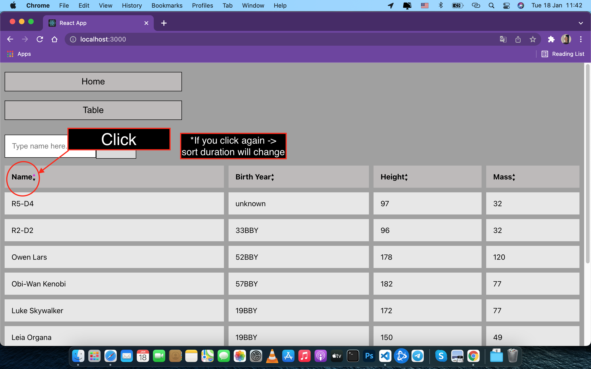
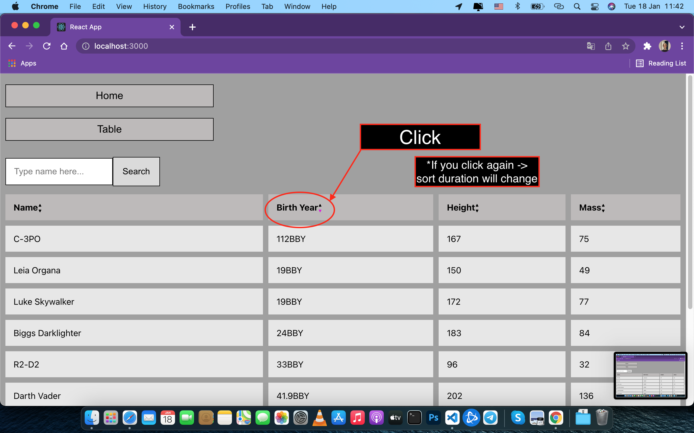
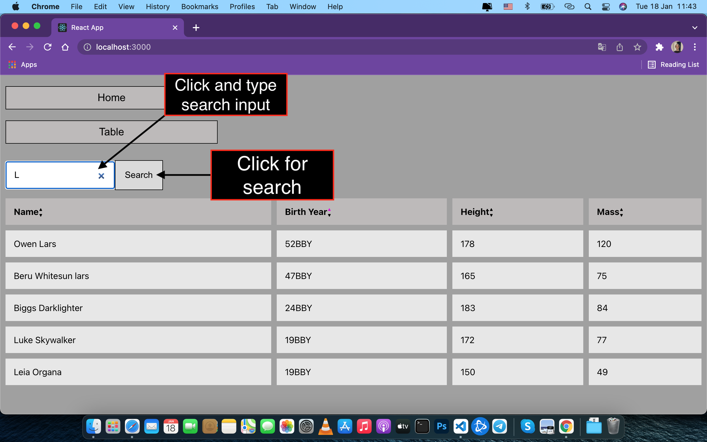

# sidebar

## Instalation Instructions

### First, install npm package
`npm install` or `yarn install`

### After, run the aplication
`npm start` or `yarn start`

## User Instructions

Main Page

Click on the `home` button to see Greeting

Click on the `table` button to see the Table

Click on the `table Name or Birth Year, Height, Mass` to see the row sort

Click on the `Search input:('Type name here...')` and click `Search` button to search Table

## Available Scripts

In the project directory, you can run:

### `npm start`

Runs the app in the development mode.\
Open [http://localhost:3000](http://localhost:3000) to view it in your browser.

The page will reload when you make changes.\
You may also see any lint errors in the console.

### `npm test`

Launches the test runner in the interactive watch mode.\
See the section about [running tests](https://facebook.github.io/create-react-app/docs/running-tests) for more information.

### `npm run build`

Builds the app for production to the `build` folder.\
It correctly bundles React in production mode and optimizes the build for the best performance.

The build is minified and the filenames include the hashes.\
Your app is ready to be deployed!

See the section about [deployment](https://facebook.github.io/create-react-app/docs/deployment) for more information.

